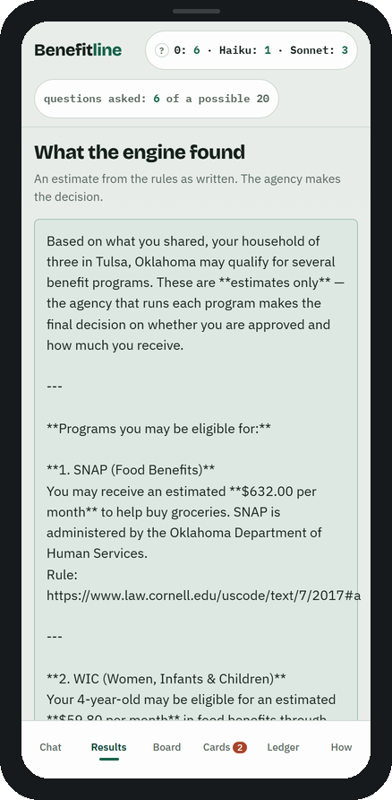
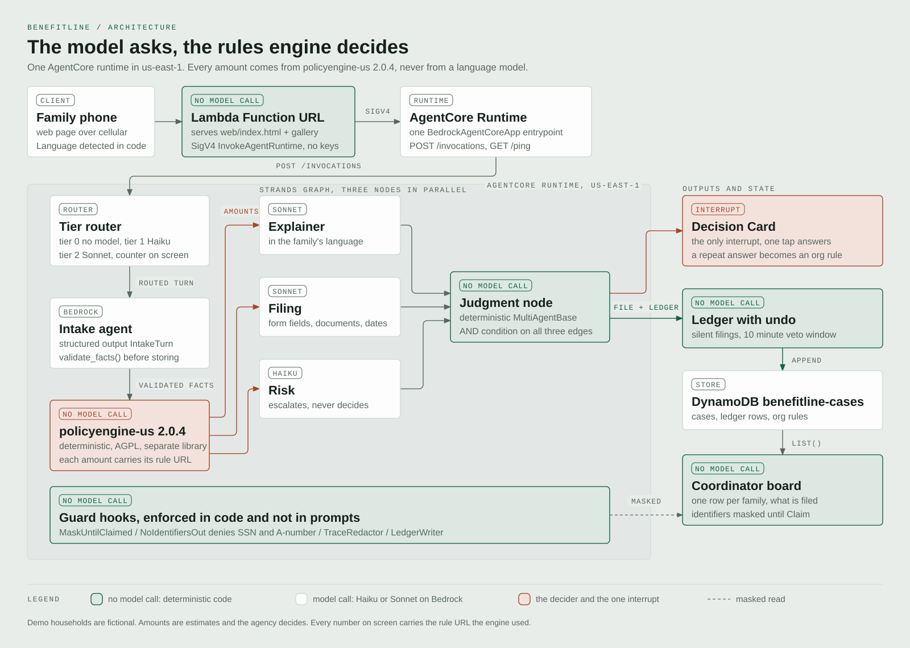
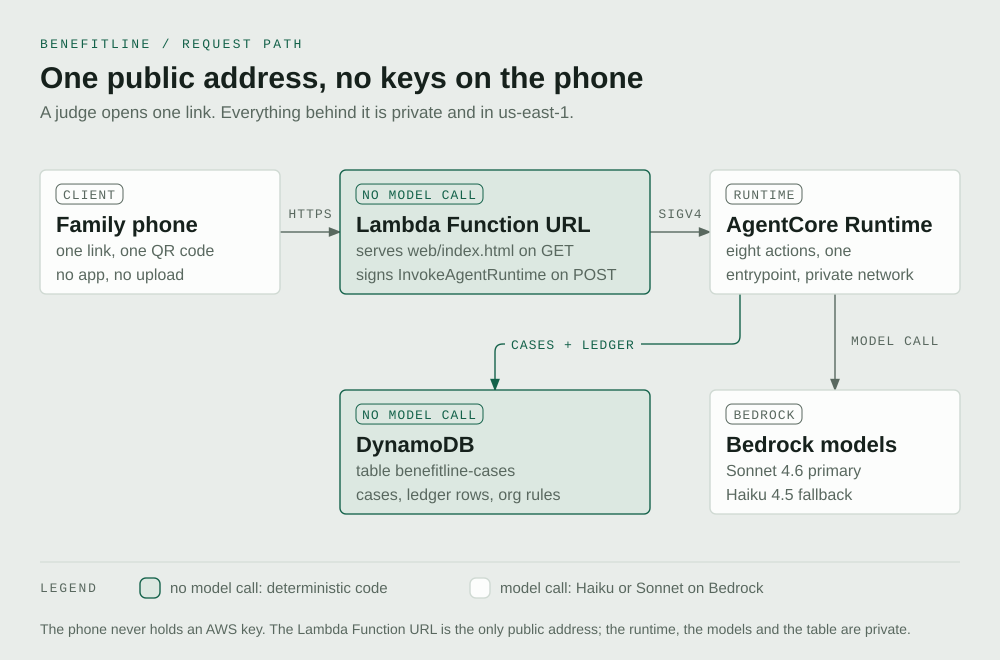
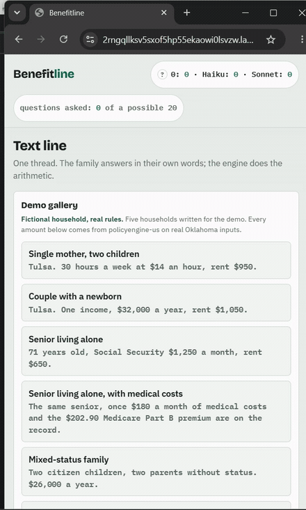

# Benefitline

<p>


<a href="LICENSE"></a>
<a href="https://2rngqllksv5sxof5hp55ekaowi0lsvzw.lambda-url.us-east-1.on.aws/"></a>
</p>

Built for the **AWS Agents for Humans** hackathon, Good Neighbor track.

**One text line that computes what a family qualifies for, cites the rule under every
number, and files it.**

<table>
<tr>
<td width="330" valign="top">

</td>
<td valign="top">
<p><strong>Open it on a phone.</strong> One link, nothing to install, nothing to upload.</p>
<p>Live demo: <a href="https://2rngqllksv5sxof5hp55ekaowi0lsvzw.lambda-url.us-east-1.on.aws/">https://2rngqllksv5sxof5hp55ekaowi0lsvzw.lambda-url.us-east-1.on.aws/</a></p>
<p></p>
<p>Five fictional Oklahoma households, real federal and state rules, computed by
<code>policyengine-us</code> 2.0.4. No model states a dollar figure.</p>
</td>
</tr>
</table>

<em>The phone screenshot is a real capture of the running product.</em>

## Architecture at a glance



Full size: [`submission/architecture.svg`](submission/architecture.svg).

The request path:



Full size: [`submission/request_path.svg`](submission/request_path.svg).

One Bedrock AgentCore Runtime holds the whole agent, with a single `BedrockAgentCoreApp`
entrypoint serving `chat`, `start_case`, `board`, `board_ask`, `claim`, `answer_card`,
`undo`, `gallery` and `reset`. One Lambda Function URL is the only public address: it serves
`web/index.html` on GET and SigV4-signs `InvokeAgentRuntime` on POST. One URL, one QR
code. Coordinator board state lives in DynamoDB through `DynamoStore`; `LocalJsonStore`
backs local runs and evals. Everything is in `us-east-1`.

The Strands pieces:

- **Agent with structured output.** Intake returns typed facts, each carrying the id of
  the message it came from. `validate_facts()` drops any fact without a citation.
- **Graph with an AND-condition judgment node.** Three specialists (explainer, filing,
  risk) run in parallel as Graph nodes. Strands Graph runs nodes in parallel; Swarm does
  not. A fourth node, `judgment`, is deterministic code and fires only on an AND condition
  across all three incoming edges, so no partial result reaches a coordinator.
- **Hooks and interventions.** `BeforeToolCallEvent` and `AfterToolCallEvent` carry the
  four guards. Registration order matters: Strands runs `AfterToolCallEvent` callbacks in
  reverse registration order, so `TraceRedactor` registers before `MaskUntilClaimed`. Use
  `guards()` rather than registering by hand.
- **ModelRouter fallback.** `us.anthropic.claude-sonnet-4-6` primary, the same Sonnet 4.6
  through `global.anthropic.claude-sonnet-4-6` next (Bedrock meters the daily token quota
  per inference profile, and one profile ran dry twice on build day while the other
  answered), `us.anthropic.claude-haiku-4-5-20251001-v1:0` last, `max_switches=2`. The
  fallback runs the same guards and the same `validate_facts()`, so a downgrade cannot
  lower the bar.
- **FileSessionManager** for local session state.

## The problem

SNAP reached 88 percent of eligible individuals in FY2022, the highest rate on
record.[1] Participation was 81 percent in FY2020.[2] The gap falls hardest on the
households that show up at a community help desk: 76 percent for households with earned
income, 55 percent for elderly individuals, 50 percent for eligible noncitizens.[3]

WIC reached 56.1 percent of eligible people in 2023. In nonmetro areas, 24.0 percent;
in metro areas, 61.1 percent.[4] The IRS says four out of five eligible taxpayers receive
the Earned Income Tax Credit.[5]

Losing a benefit is usually paperwork, not income. Of 56.1 million Medicaid renewals due
from March through December 2023, 9.7 million people were disenrolled for procedural
reasons, 71 percent of all terminations.[6] In Oklahoma, among renewals due in
December 2023, 49.1 percent of terminations were procedural.[7]

Nine programs, nine rulebooks. The arithmetic is public and deterministic. What is missing
is somebody to sit down and do it.

Sources:

1. USDA FNS, "Trends in SNAP Participation Rates: FY2020 and FY2022", Table 1 p.9
   (exact 87.6).
   <https://www.fns.usda.gov/sites/default/files/resource-files/ops-snap-trendsfy20-fy22-report.pdf>
2. Same report, Table 2 p.10.
3. Same report, Table 2 p.10, FY2022 column.
4. USDA FNS, "National and State-Level Estimates of WIC Eligibility and Program Reach in
   2023", Table 2.
   <https://www.fns.usda.gov/sites/default/files/resource-files/wic-eer2023-report.pdf>
5. IRS EITC Central, "50 years of Earned Income Tax Credit".
   <https://www.irs.gov/tax-professionals/eitc-central/50-years-of-earned-income-tax-credit>
6. CMS, "Medicaid and CHIP National Summary of Renewal Outcomes, December 2023 and
   National Summary to Date", p.11. <https://www.medicaid.gov/media/174626>
7. Same document, p.9. Oklahoma, renewals due in December 2023 only.

Every figure above has a row in [`data/SOURCES.md`](data/SOURCES.md) with its URL and
fetch date. A number without a row does not enter this README, the video, or the pitch.

## What it does



One session on the live link: the family answers in plain words, the engine prices nine
programs with a citation under each amount, and a guard denies a tool call that carried an
identifier.

A family sends one text line. Benefitline asks the questions the rules need, one at a time,
and shows a counter on screen: "questions asked: 6 of a possible 6." Then it hands the
facts to `policyengine-us` 2.0.4 and shows exact amounts, each with the statute or
regulation under it.

A single mother of two in Tulsa sees SNAP at $632 per month, Medicaid for the children,
and WIC at $59.80 per month. On the tax side: the federal EITC at $7,316, the Oklahoma
EITC at $269.57, and the Child Tax Credit at $4,400 with $2,901 refundable. Every card
links its rule: 7 U.S.C. 2017(a) under SNAP, 7 CFR 246.7(e) under WIC. A card can be
expanded to show the arithmetic: gross $1,820.00, standard deduction -$209.00, earned
income deduction of 20 percent -$364.00. Above the cards: "An estimate from the rules as
written. The agency makes the decision."

From there the agent produces a filing plan per program: the real form (OKDHS 08MP001E for
SNAP, the SoonerCare online application for Medicaid), the document checklist, and the
deadline.

A coordinator sees one board with every case. Names, phone numbers and addresses stay
masked until somebody types their name and claims the case. The mask is a hook on the tool
result, not an instruction in a prompt.

The agent interrupts the coordinator once per case, with a Decision Card: the question, the
options, a recommended default, the deadline, and the evidence behind it. One tap answers
it. The same answer given twice becomes a standing rule for that organization.

Every action is written to a ledger with a 10-minute undo window. Undo reverses the
action, not just the log line.

## How it works

**The model asks. The engine decides.** The agent gathers eleven facts, cites the message
each fact came from, and hands them to `policyengine-us` 2.0.4. No model states a dollar
figure. Every amount on screen carries the rule it came from as a tappable link.

**Three tiers, most of them free.** Tier 0 is deterministic code with no model call:
language detection by script, yes/no and number parsing, the missing-fact list, the engine
call, form filling, deadline arithmetic, and the masks. Tier 1 is Haiku 4.5 for short
replies tier 0 could not parse. Tier 2 is Sonnet 4.6 for everything else. The tier counter
is on screen during the demo.

**A human is interrupted only by a card.** When the engine's gates put a question outside
the software's competence, the case escalates to a Decision Card: the situation, three
options with consequences, a default, a deadline, and links to the evidence. One tap
answers it. A repeated answer becomes a standing rule. There is a weekly interrupt budget;
when it is spent, only deadline-driven cards surface and the rest are auto-answered with
their default and written to the ledger.

**Language.** The intake detects the family's language from the script it is written in and
replies in that language. The demo gallery scripts are all English.

**Guards are code, not prompts.** Strands hooks and interventions in
`src/benefitline/hooks.py`:

- `MaskUntilClaimed`: names, phones and addresses show as dots on the coordinator board
  until the coordinator who claimed that case is the one looking. The decision reads the
  stored `CaseRecord.claimed_by`, not a per-call flag.
- `NoIdentifiersOut`: an intervention that denies any outbound tool call carrying an SSN or
  A-number in its input, including nested and split across arguments.
- `TraceRedactor`: identifiers are stripped from traces.
- `LedgerWriter`: one ledger row per tool call, denied calls included. A denial is visible
  on screen in the demo.

## Demo gallery

Five fictional households, real rules. Nobody uploads their own data. The households are
written for the demo and labeled fictional on screen; the programs, dollar amounts, forms,
citations and deadlines are real Oklahoma and federal rules for 2026.

| Case | Household | Written to show |
|---|---|---|
| 1 | Single mother, two children, Tulsa. 30 hours a week at $14 an hour, rent $950. | The base path: chat, engine, rule links. |
| 2 | Couple with a newborn, Tulsa. $32,000 a year, rent $1,050. | WIC for the mother and the infant. |
| 3 | Senior living alone, 71, Social Security $1,250 a month, rent $650. | The baseline before the medical deduction. |
| 3b | The same senior, with out-of-pocket medical costs reported. | The excess medical deduction, 7 CFR 273.9(d)(3). |
| 4 | Mixed-status family. Two citizen children, two parents without status. $26,000 a year. | Masking, escalation, and an honest zero. |
| 5 | Already on SNAP, renewal due. Norman, parent and a 12-year-old. | Deadlines and recertification. |

### Ground truth

Generated from [`gallery/ground_truth.json`](gallery/ground_truth.json), computed by
`policyengine-us` 2.0.4 for tax year 2026, state OK. These are the only numbers allowed
on screen.

| Program | Unit | Case 1 | Case 2 | Case 3 | Case 3b | Case 4 | Case 5 |
|---|---|---|---|---|---|---|---|
| SNAP (food) | USD/month | 632.00 | 357.00 | 148.00 | 298.00 | 546.00 | 433.00 |
| WIC (conditional on a clinic risk finding) | USD/month | 59.80 | 271.72 | not eligible | not eligible | 59.80 | not eligible |
| Medicaid (SoonerCare) | eligibility | members 0, 1, 2 | members 0, 1, 2 | member 0 | member 0 | members 2, 3 | members 0, 1 |
| TANF (cash) | USD/month | not eligible | not eligible | not eligible | not eligible | not eligible | not eligible |
| EITC (federal) | USD/year | 7,316.00 | 4,292.77 | not eligible | not eligible | 0.00 | 4,427.00 |
| Oklahoma EITC | USD/year | 269.57 | 125.03 | not eligible | not eligible | 0.00 | 179.20 |
| Child Tax Credit (federal) | USD/year | 4,400.00 | 2,200.00 | not eligible | not eligible | 1,000.00 | 2,200.00 |
| Child Tax Credit, refundable part | USD/year | 2,901.00 | 1,700.00 | not eligible | not eligible | 0.00 | 1,700.00 |
| SSI | USD/year | not eligible | not eligible | not eligible | not eligible | not eligible | not eligible |
| LIHEAP | not computed | agency screening | agency screening | agency screening | agency screening | agency screening | agency screening |

Two rows need their condition read with them.

- **WIC is conditional on a clinic risk finding.** The engine's
  `is_wic_at_nutritional_risk` defaults to true, so every WIC amount assumes a WIC clinic
  finds nutritional risk under 7 CFR 246.7(e). The condition is printed next to the amount
  on screen.
- **LIHEAP is not computed.** `policyengine-us` 2.0.4 models LIHEAP for the District of
  Columbia, Illinois, Massachusetts and Riverside County, California, not for Oklahoma.
  Benefitline flags LIHEAP for Oklahoma DHS
  screening and shows no amount and no guess. The card links to
  https://oklahoma.gov/okdhs/services/liheap.html.

Case 4's $1,000 is not the ordinary Child Tax Credit. With no valid SSN the parents fail
the federal EITC and the refundable CTC entirely, which is why both read 0. What remains
is two $500 Credits for Other Dependents under 26 USC 24(h)(4), and those are available
only if the parents file with an ITIN. The children's SNAP and SoonerCare are unaffected,
which is what the escalation card asks the coordinator about.


## Eval bench

The gallery is the eval bench: the engine's own output is the answer key, so a run either
matches ground truth or it does not.

**Verdict: PASS.** Run started 2026-09-14 11:42 America/Chicago; all 12 runs (six
households, two repeats each) finished in six questions or fewer with every fact and every
engine amount matching ground truth. Results from [`evals/RESULTS.md`](evals/RESULTS.md):

| Case | Language | Questions asked | Facts matched | Engine match | Tier counts |
|---|---|---|---|---|---|
| 1 | en | 6 | 37/37 | pass | 4/0/3 |
| 2 | en | 6 | 37/37 | pass | 4/0/3 |
| 3 | en | 5 | 15/15 | pass | 5/0/1 |
| 3b | en | 6 | 15/15 | pass | 6/0/1 |
| 4 | en | 5 | 48/48 | pass | 4/0/2 |
| 5 | en | 6 | 26/26 | pass | 5/0/2 |

Tier counts are tier 0 (regex, no model) / tier 1 (Haiku) / tier 2 (Sonnet) turns. The
earlier run that morning failed three of six cases (a breastfeeding flag stored on the baby,
an off-target question spending the budget, a one-age reply overwriting the mother's age);
each defect got a code validator, not a prompt change, and the run above is the rerun.

The bench is Strands Evals 1.2.0 with a user simulator playing each household. Six
deterministic checks per run: questions asked, facts matched field by field against ground
truth, engine output compared to `gallery/ground_truth.json` at two decimal places, every
fact cited to a family message, no dollar figure in any model reply, and reply language.
The engine's own output is the answer key, so a paraphrase that moves an amount is caught.
Reproduce with `python evals/bench.py`.

The test suite is separate and green: `python -m pytest evals/ -q -m "not live"` (no model
calls) returned 262 passed on 2026-09-14. The full suite including the live Bedrock tests,
`python -m pytest evals/ -q`, returned 311 passed and 3 failed earlier that day; the three
were fixed at the root (two intake defects, one stale value in a test script) and each
passed on one rerun.

Test files: `evals/test_core_units.py`, `evals/test_core_review.py`,
`evals/test_intake_units.py`, `evals/test_intake_review.py`, `evals/test_forms_units.py`,
`evals/test_service_units.py`, `evals/test_service_review.py`,
`evals/test_specialists_review.py`, `evals/test_specialists_markdown.py`,
`evals/test_hooks_live.py`, `evals/test_specialists_live.py`. The `_live` files and the
live-marked tests in the `_review` files call Bedrock and are marked `live`.

## Running locally

The web page needs nothing installed:

```
# open web/index.html in any browser, including from disk (file://)
```

No build step, no bundler, no server. With no API configured the page runs in mock mode,
shows a "mock" badge, and answers every action from the real `policyengine-us` 2.0.4
numbers in `gallery/ground_truth.json`. The demo works offline. To point it at a
deployment, add `?api=https://your-endpoint` to the URL or set
`window.BENEFITLINE_API` before the page's script runs. After any engine change,
regenerate the embedded numbers with:

```
python _runs/2026-09-13_phase3_web/gen_mockdata.py
```

Do not hand-edit those numbers.

To run the agent:

```
python -m pytest evals/test_service_units.py -q          # the API surface, no model calls
python src/app.py                                        # local runtime on :8080
curl -s http://127.0.0.1:8080/ping
curl -s -X POST http://127.0.0.1:8080/invocations \
  -H "Content-Type: application/json" \
  -d '{"action":"gallery","session_id":"<36 characters or more>"}'
python deploy/deploy.py                                  # the whole cloud path
```

`.env` in the project root holds the AWS credentials and the two model ids. It is never
committed and the scripts never print it. Bedrock model access for both models must be
enabled in the console in `us-east-1`; that is the step that blocks a first run. Full
deployment and rollback steps are in [`deploy/README.md`](deploy/README.md).

Live demo: [https://2rngqllksv5sxof5hp55ekaowi0lsvzw.lambda-url.us-east-1.on.aws/](https://2rngqllksv5sxof5hp55ekaowi0lsvzw.lambda-url.us-east-1.on.aws/)

## Honesty notes

- **These are estimates. The agency decides.** Every screen says so. Benefitline computes
  the rules as written; it does not adjudicate.
- **LIHEAP is not modeled for Oklahoma.** The engine covers LIHEAP for DC, Illinois,
  Massachusetts and Riverside County, CA. Benefitline flags it for agency screening and shows no amount.
- **CHIP is not modeled separately.** Oklahoma children are covered under Medicaid to
  210 percent of the poverty line (`chip/child/income_limit.yaml` carries `OK: -.inf`).
  CHIP was dropped from the program list rather than shown as a zero.
- **Assets are assumed zero.** Harmless for Oklahoma SNAP, which has broad-based
  categorical eligibility and no asset limit. Load-bearing for the senior non-MAGI Medicaid
  pathway in case 3, which is labeled on screen "if countable assets are under the limit".
- **SNAP work-rule hours are asked, not assumed.** A childless adult aged 18 to 59 with no
  reported weekly hours fails the ABAWD work requirement and prices at zero, so the intake
  asks for hours before pricing such a household.
- **WIC is conditional.** Every WIC amount assumes a clinic finds nutritional risk under
  7 CFR 246.7(e).
- **Oklahoma only.** `compute()` refuses any other state rather than mispricing it
  silently. It also refuses a household with no head, two heads, two spouses, no members,
  or negative rent, naming the missing fact.
- **Case 4's $1,000 is a Credit for Other Dependents, not the Child Tax Credit,** and it
  rests on the parents having an ITIN, which the engine assumes. The card in
  `web/index.html` carries the engine note under the amount: "Filer has no valid SSN: this
  is the $500-per-dependent other-dependent credit (26 USC 24(h)(4))".
- **The coordinator board has no login.** `claim`, `answer_card` and `undo` take a
  coordinator name, not a credential, and the board is shared across sessions. Masking
  protects the family from a coordinator who has not claimed the case, not from someone who
  can reach the URL. A real deployment puts the board behind AgentCore Identity; the demo
  does not.
- **The live URL is a public Lambda Function URL with no rate limit** beyond the account's
  Lambda concurrency. It is a hackathon demo, not a production endpoint.
- **Case 3b uses the 2026 Medicare Part B standard premium of $202.90.** With $180 a month
  of other medical costs, the excess medical expense deduction is $347.90, net income falls
  to zero, and SNAP reaches $298, the one-person maximum allotment.
- **The demo households are fictional.** Their income levels are chosen, not measured. The
  $14 an hour wage in case 1 is a chosen above-minimum wage; the Oklahoma minimum is
  $7.25. The rents in the gallery, $650 to $1,050, sit below the Tulsa ACS 2024 median
  gross rent of $1,099.
- **Cut from the plan and not present:** an AgentCore Gateway, a Cedar policy intervention
  (`cedarpy` is not installed; the hook-based `MaskUntilClaimed` is the shipped guard),
  real SMS delivery, and an MCP server surface.

## Licensing

This repository is MIT licensed. See [`LICENSE`](LICENSE).

`policyengine-us` 2.0.4 is licensed AGPL-3.0. Benefitline does not modify it. It installs
the released wheel from PyPI and calls it as a separate library from one file,
`src/benefitline/engine.py`. The version in use is printed beside every number in the
product, and the corresponding source is at
https://github.com/PolicyEngine/policyengine-us (tag `2.0.4`).

Anyone hosting a modified Benefitline that patches, vendors, or forks the engine triggers
AGPL-3.0 section 13 and must offer the corresponding source of that modified engine to
every user of the service over the network. The rule in this repository: no local patch to
the engine. Corrections are made on Benefitline's side of the boundary, as was done for
`ssn_card_type`, or they go upstream. The full third-party license inventory is in
[`submission/LICENSE_NOTES.md`](submission/LICENSE_NOTES.md).

US federal and Oklahoma statutes, regulations, and agency forms are government works and
are not covered by this repository's license.

## Sources

Every number in this README, the video, and the product traces to a row in
[`data/SOURCES.md`](data/SOURCES.md). Each row carries what it supports, the primary
source, the URL, the fetch date in US Central time, and the caveats that travel with it.
The file is grouped into: the engine, participation gaps, the gallery household levels,
and forms and deadlines. It records two corrections that override earlier drafts: the
pre-pandemic SNAP rate is 81 percent (not 78), and the Tulsa rent band is below median
(not typical).
